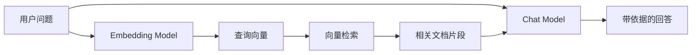

# 第 1 周学习笔记：LLM 基础与 Java 原生 API 客户端

> **学习日期：** 2026-06-20～2026-06-22
>
> **学习阶段：** 第 1 周 · 第 1～4 天
>
> **本节目标：** 理解 LLM 的基本概念，使用 Java 21 原生 `HttpClient` 实现可复用、可观测、可测试的 DeepSeek API 客户端，并通过受控实验分析 Temperature、Token、延迟和输出稳定性。

## 目录

- [1. Token](#1-token)
- [2. 上下文窗口](#2-上下文窗口)
- [3. 消息角色](#3-消息角色)
- [4. 常用生成参数](#4-常用生成参数)
- [5. Chat Model 与 Embedding Model](#5-chat-model-与-embedding-model)
- [6. Java 原生 LLM API 客户端](#6-java-原生-llm-api-客户端)
- [7. Day04 参数对照实验](#7-day04-参数对照实验)
- [8. 关键结论](#8-关键结论)
- [9. 自测问题](#9-自测问题)
- [10. 参考资料](#10-参考资料)

---

## 1. Token

### 1.1 什么是 Token

Token 是模型处理文本时使用的离散编码单元。它可能是一个完整单词、一个子词、一个汉字、标点符号，或者其他字符序列，具体切分结果取决于模型使用的 tokenizer。

例如，英文单词 `tokenization` 可能被拆分为：

```text
token + ization
```

因此，把 Token 简单理解为“AI 眼里的词”只适合作为初步类比，并不严格。更准确的说法是：

> Token 是文本经过 tokenizer 编码后，模型实际接收和生成的基本单位。

可以使用 [OpenAI Tokenizer](https://platform.openai.com/tokenizer) 观察具体文本的切分方式。


> [!NOTE]
> “英文约 4 个字符或 0.75 个单词对应 1 Token”只是粗略经验，不能直接套用于中文、代码、公式或特殊符号。实际数量应由目标模型对应的 tokenizer 计算。

### 1.2 Token、字符与单词的区别

| 单位 | 示例 | 特点 |
|---|---|---|
| 字符（Character） | `t`、`o`、`中` | 粒度最细，序列通常较长 |
| 单词（Word） | `tokenization`、`模型` | 符合人类语言习惯，但词表可能过大，且存在未登录词问题 |
| Token | `token`、`ization`，或单个汉字/字符组合 | 由 tokenizer 决定，在词表规模与序列长度之间折中 |

很多 tokenizer 使用 BPE 或相关子词算法，但不能把所有模型的分词方式都笼统断言为 BPE；应以具体模型说明为准。

### 1.3 Token 为什么重要

Token 数量通常直接影响：

- **上下文容量：** 输入与输出不能无限增长。
- **请求成本：** API 往往按输入和输出 Token 分别计费。
- **响应延迟：** 输入越长、生成越多，处理时间通常越长。
- **信息密度：** 冗长 Prompt 会占用可用于文档、历史消息和回答的空间。

---

## 2. 上下文窗口

上下文窗口（Context Window）是模型在一次推理中能够处理的最大 Token 范围。通常需要同时考虑：

```text
指令 + 历史消息 + 当前输入 + 工具结果/检索内容 + 模型输出
```

对于推理模型，还可能存在不可见的 reasoning tokens。它们可能占用输出预算或上下文容量，具体计算方式取决于模型与 API，不能一概而论为“可见思维链”。API 通常不会向应用暴露模型的完整内部思维链。

### 2.1 超出窗口后会发生什么

不同 API、SDK 或应用框架可能采取不同策略：

- 直接拒绝请求并返回长度错误；
- 由客户端或框架截断部分输入；
- 由应用删除旧消息或压缩历史记录；
- 减少可生成的最大输出长度。

因此，“超出部分一定会自动截断”并不准确。生产系统必须显式设计 Token 预算和历史裁剪策略，不能依赖未知的默认行为。

### 2.2 上下文窗口不等于长期记忆

模型只能利用本次请求中实际提供的上下文。即便 API 支持 Conversation、`previous_response_id` 等会话机制，也只是平台或应用帮助保存并重新关联上下文，不代表模型参数在对话后被永久修改。

> [!IMPORTANT]
> “模型记住了上一次对话”通常意味着系统重新提交或引用了历史状态，不意味着模型在一次聊天后完成了训练。

---

## 3. 消息角色

不同 API 和模型支持的角色可能不同。常见角色如下：

| 角色 | 主要职责 | 注意事项 |
|---|---|---|
| `developer` | 定义应用级行为、规则和约束 | 通常优先于用户消息；适合放置由开发者控制的稳定指令 |
| `system` | 提供高层系统指令 | 是否使用及其具体优先级需查看目标 API 和模型文档，不能与 `developer` 无条件视为同一角色 |
| `user` | 表达最终用户的请求和输入数据 | 属于不可信输入，不应获得修改高层规则的权限 |
| `assistant` | 保存模型先前的回复或提供示例回答 | 可用于多轮上下文和 few-shot 示例，但不保证示例事实正确 |

示例：

```text
Developer: 你是企业知识库助手。只能根据提供的资料回答；证据不足时明确拒答。
User:      根据员工手册，年假如何计算？
Assistant: 根据当前提供的员工手册片段……
```

### 3.1 指令角色不是安全边界

高优先级消息有助于约束模型行为，但不能替代程序控制：

- 权限应在数据库或检索层执行；
- 工具参数必须由 Java 代码校验；
- 模型输出必须视为不可信数据；
- 敏感信息不能仅靠一句“不要泄露”保护。

把 `User` 类比为“函数参数”有一定帮助，但模型并不是严格执行函数，输出具有概率性，仍需验证。

---

## 4. 常用生成参数

> [!WARNING]
> 参数名称、取值范围和支持情况与 API、模型及版本有关。下面是概念说明，不是所有 OpenAI 模型都支持的固定参数表。编码前必须检查所用端点和模型的官方 API Reference。

| 参数/概念 | 作用 | 使用注意 |
|---|---|---|
| `temperature` | 调整采样随机性 | 较低值通常更稳定，但不保证事实正确；部分推理模型可能不支持调整 |
| `top_p` | 核采样，只考虑累计概率达到阈值的候选 Token | 通常不建议在实验中同时大幅调整 `temperature` 与 `top_p`，否则难以归因 |
| 输出上限 | 限制可生成的最大 Token 数 | Responses API 与 Chat Completions API 的字段名可能不同，例如 `max_output_tokens` 或 `max_completion_tokens` |
| `stop` | 遇到指定序列时停止生成 | 并非所有模型都支持；停止序列也可能意外截断有效内容 |
| `frequency_penalty` | 根据出现频率降低重复 Token 的概率 | 适用范围和取值限制应以具体模型文档为准 |
| `presence_penalty` | 对已经出现过的 Token 施加惩罚 | 可能促进话题扩展，也可能降低回答连贯性 |
| `seed` | 尝试提高重复请求的可复现性 | 即使支持，也不应承诺完全确定性；后端变化仍可能导致结果不同 |
| `stream` | 增量返回生成事件 | 改善首 Token 等待体验，但不会自动减少总计算量或总成本 |
| `reasoning.effort` | 调整推理模型的推理投入 | 可选值和支持模型会变化，必须根据当前模型文档配置 |

### 4.1 原文中需要删除或修正的参数描述

- **`top_k`：** 它是常见采样概念，但不是 OpenAI 主流文本生成 API 中可默认假定存在的通用请求参数，不应直接列入 OpenAI 参数模板。
- **`max_tokens`：** 这是部分旧接口中的字段。新代码应根据所用 API 使用当前字段，不能无条件复制。
- **`seed`：** 只能提高可复现性，不能“保证输出一致”。
- **`reasoning_effort`：** 不应绑定未经核实的模型名称，也不能假定所有模型都支持相同枚举值。

### 4.2 参数使用原则

与其死记“事实问答必须设为 0、创意写作必须设为 1.2”，更合理的做法是：

1. 先定义任务成功标准；
2. 固定模型、Prompt 和测试集；
3. 每次只修改一个主要变量；
4. 重复运行并记录准确性、稳定性、Token 和延迟；
5. 根据实验结果选择参数。

> [!CAUTION]
> `temperature = 0` 只表示尽量选择高概率输出，不表示模型具备事实数据库，也不表示不会产生稳定、重复的错误。

---

## 5. Chat Model 与 Embedding Model

### 5.1 什么是 Embedding

Embedding 是数据的数值向量表示，用于保留内容或语义的某些特征。语义相近的文本，其向量在所选距离度量下通常更接近。

Embedding 常用于：

- 语义检索
- 聚类
- 推荐
- 异常检测
- 分类
- RAG 文档召回

“Embedding 用于衡量文本相关性”方向基本正确，但应补充两个限制：

1. 向量模型只生成表示，不直接给出自然语言答案；
2. 向量距离表示模型学习到的相似性，不等价于事实正确、逻辑蕴含或业务相关。

### 5.2 两类模型对比

| 对比维度 | Chat Model | Embedding Model |
|---|---|---|
| 输入 | 文本、消息，部分模型还支持图像、音频等 | 通常是文本或其他待编码数据 |
| 输出 | 自然语言、结构化文本、工具调用等 | 固定维度的数值向量 |
| 主要任务 | 问答、生成、摘要、抽取、推理 | 检索、聚类、推荐、相似度计算 |
| 是否直接生成答案 | 是 | 否 |
| 是否天然有状态 | 否；状态通常由应用或 API 会话机制管理 | 否；相同输入独立编码 |
| RAG 中的职责 | 基于检索上下文生成回答 | 将查询和文档编码为向量以支持召回 |

典型 RAG 数据流：



原文中“聊天模型是有状态的”是不准确的。聊天体验之所以表现出连续性，是因为应用或 API 保存并关联了历史消息，而不是因为模型实例天然保存了每个用户的会话。

---

## 6. Java 原生 LLM API 客户端

### 6.1 本阶段完成的调用链

项目路径为 `codes/llm-basics`，没有使用 Spring AI 或厂商 SDK，而是直接实现以下过程：

```text
ChatRequest Java 对象
    → Jackson 序列化
请求 JSON
    → Java HttpClient 发送 HTTPS POST
DeepSeek Chat Completions API
    → 返回 HTTP 状态和响应 JSON
    → Jackson 反序列化
ChatResponse Java 对象
    → 读取回答、推理内容、Token 和耗时
```

不使用上层 SDK 的目的不是重复造轮子，而是理解 SDK 通常隐藏的协议细节：

- 请求地址如何组成；
- API Key 如何进入 HTTP Header；
- Java 字段如何映射到 JSON 字段；
- HTTP 成功与业务解析成功为什么是两回事；
- Token、状态码和耗时如何被观测。

### 6.2 项目职责划分

| 类型 | 职责 | 不应承担的职责 |
|---|---|---|
| `App` | 读取环境变量、组装请求、调用客户端、输出结果 | 拼接 HTTP 请求和解析原始 JSON |
| `DeepSeekClient` | 序列化、发送请求、判断状态、解析响应和统计耗时 | 构造具体业务 Prompt |
| `ChatMessage` | 表达发送给模型的请求消息 | 表达响应专属字段 |
| `ChatRequest` | 表达完整请求 JSON | 执行网络调用 |
| `AssistantMessage` | 表达模型返回的消息和推理内容 | 表达用户输入 |
| `ChatResponse` | 表达完整响应，并安全读取回答 | 保存 API Key 或发送请求 |

这种分层使入口类不依赖原始 JSON，也为后续单元测试和故障模拟留下边界。

### 6.3 使用 record 表达 DTO

DTO（Data Transfer Object）用于表示跨边界传输的数据。Java `record` 会自动提供构造器、访问方法、`equals()`、`hashCode()` 和 `toString()`，适合表示 API 请求与响应：

```java
public record ChatMessage(
        String role,
        String content
) {}
```

访问 record 字段使用：

```java
message.role();
message.content();
```

而不是传统 JavaBean 的 `getRole()` 和 `getContent()`。

DTO 应主要描述协议结构。如果把网络发送、重试或业务判断全部塞入 DTO，会破坏职责边界，也会使测试困难。

### 6.4 Jackson 序列化与反序列化

Java 对象转换成 JSON 称为序列化：

```java
String requestBody = objectMapper.writeValueAsString(chatRequest);
```

JSON 转换成 Java 对象称为反序列化：

```java
ChatResponse response = objectMapper.readValue(
        httpResponse.body(),
        ChatResponse.class
);
```

当 Java 命名和 JSON 命名不一致时，使用 `@JsonProperty`：

```java
@JsonProperty("reasoning_content")
String reasoningContent
```

对应关系为：

```text
JSON reasoning_content ↔ Java reasoningContent
```

当服务端可能增加当前程序不关心的字段时，可以在响应 DTO 上使用：

```java
@JsonIgnoreProperties(ignoreUnknown = true)
```

但不能机械地忽略所有字段。有业务价值的字段应显式建模，否则协议变化可能被程序静默吞掉。

### 6.5 请求和响应 DTO 为什么要分离

请求消息通常只有：

```json
{
  "role": "user",
  "content": "Hello"
}
```

启用思考模式后的响应消息还可能包含：

```json
{
  "role": "assistant",
  "content": "最终回答",
  "reasoning_content": "推理内容"
}
```

因此项目使用 `ChatMessage` 表达请求消息，使用 `AssistantMessage` 表达响应消息。二者强行共用一个 DTO 会导致：

- 请求对象出现没有语义的 `reasoningContent`；
- 序列化时可能发送 `reasoning_content: null`；
- 响应增加 `tool_calls` 等字段后，共用类型会继续膨胀；
- 无法从类型上区分“用户输入”和“模型输出”。

类型相似不代表职责相同。DTO 应按协议方向和真实语义划分，而不是为了少写一个类而合并。

相应的具体示例如图：


### 6.6 实际请求 JSON

当前代码构造的请求近似为：

```json
{
  "model": "deepseek-v4-pro",
  "messages": [
    {
      "role": "system",
      "content": "You are a helpful assistant"
    },
    {
      "role": "user",
      "content": "Hello"
    }
  ],
  "stream": false,
  "reasoning_effort": "high",
  "thinking": {
    "type": "enabled"
  }
}
```

Python SDK 示例中的：

```python
extra_body={"thinking": {"type": "enabled"}}
```

表示让 SDK 把 `thinking` 追加到最终请求体。`extra_body` 本身不是最终协议字段。原生 Java 客户端应发送顶层 `thinking`，不能把它错误地嵌套在 `extra_body` 中。

### 6.7 base URL 与完整接口 URL

厂商 SDK 通常只要求配置：

```text
https://api.deepseek.com
```

当代码调用 `chat.completions.create()` 时，SDK 会追加 `/chat/completions`。Java 原生 `HttpClient` 不知道方法名对应哪个路径，因此必须使用最终地址：

```text
https://api.deepseek.com/chat/completions
```

两种写法并不矛盾：一个是 SDK 的基础地址，另一个是实际发送请求的完整地址。

### 6.8 API Key 与 Bearer 认证

项目从环境变量读取密钥：

```java
String apiKey = System.getenv("DEEPSEEK_KEY");
```

并通过 HTTP Header 发送：

```http
Authorization: Bearer <API_KEY>
```

服务器使用该凭证完成身份验证、权限判断、限流、计费和审计。Bearer 凭证一旦泄露，持有者通常可以冒用，因此必须满足：

- 不写入 Java 源码；
- 不提交到 Git；
- 不打印完整密钥；
- 不把认证 Header 放进普通日志；
- 只通过 HTTPS 发送。

### 6.9 Java HttpClient 的关键配置

连接超时配置在 `HttpClient`：

```java
HttpClient.newBuilder()
        .connectTimeout(Duration.ofSeconds(10))
        .build();
```

请求超时配置在 `HttpRequest`：

```java
HttpRequest.newBuilder()
        .timeout(Duration.ofSeconds(30));
```

两者区别：

| 超时类型 | 限制对象 | 典型故障 |
|---|---|---|
| 连接超时 | 建立 TCP/TLS 连接的时间 | 网络不可达、目标服务无法建立连接 |
| 请求超时 | 一次请求完成所允许的总时间 | 服务排队、模型生成或响应传输过慢 |

如果复用了已有连接，连接超时未必再次发生。推理模型响应较慢，不能不加分析地设置极短请求超时。

### 6.10 HTTP 成功不等于调用链成功

本次实际遇到的异常为：

```text
UnrecognizedPropertyException:
Unrecognized field "reasoning_content"
```

这说明请求已经经过以下阶段：

```text
网络连接成功
    → 服务端处理成功
    → HTTP 响应返回
    → Jackson 解析响应时失败
```

根因不是 API 无法访问，而是响应 JSON 中存在 `reasoning_content`，原 DTO 只有 `role` 和 `content`。修复方式是新增响应专属 `AssistantMessage`，显式映射该字段，并对其他未知扩展字段保持兼容。

一次完整调用至少有四层成功条件：

1. 网络连接成功；
2. HTTP 状态成功；
3. JSON 可以反序列化；
4. 必需业务字段存在且语义有效。

只检查 HTTP 200 不足以证明应用调用成功。

### 6.11 HTTP 状态与异常分类

第三天将原来统一抛出的 `IllegalStateException` 改为 `LlmClientException`。异常通过 `LlmErrorType` 表达稳定的故障类别，并保留可选的 HTTP 状态码、原始响应体和底层异常原因。上层无需解析异常字符串即可决定是否重试、告警或修正配置。

当前分类如下：

| `LlmErrorType` | 来源 | 默认可重试 |
|---|---|---|
| `AUTHENTICATION` | HTTP 401、403 | 否 |
| `RATE_LIMIT` | HTTP 429 | 是 |
| `SERVER_ERROR` | HTTP 5xx | 是 |
| `REQUEST_TIMEOUT` | HTTP 408 或 `HttpTimeoutException` | 是 |
| `NETWORK_ERROR` | `IOException`、线程中断 | 是 |
| `RESPONSE_FORMAT` | 请求序列化或响应 JSON 解析失败 | 否 |
| `CLIENT_ERROR` | 其他非 2xx 客户端错误 | 否 |

| 故障 | 常见表现 | 是否通常适合重试 |
|---|---|---|
| 参数或请求结构错误 | 400 | 否，应先修正代码或参数 |
| API Key 错误 | 401 | 否，应修正认证配置 |
| 权限不足 | 403 | 否，应检查账号或模型权限 |
| 资源或路径错误 | 404 | 否，应修正 URI 或模型标识 |
| 限流 | 429 | 可以有限重试，并遵守 `Retry-After` |
| 临时服务故障 | 502、503、504 | 通常可以有限重试 |
| 临时网络中断 | `IOException` 等 | 视错误性质有限重试 |
| JSON 映射失败 | Jackson 异常 | 否，重复请求不会修正 DTO |

合理重试需要同时满足：

```text
错误确实具有暂时性
+ 有限次数
+ 指数退避
+ 随机抖动
+ 遵守 Retry-After
+ 考虑 POST 重复执行和重复计费
```

“发生异常就重试”不是容错，而是把确定性错误重复多次。

`retryable` 目前只是错误类别的策略元数据，不表示客户端已经实现自动重试。把“允许考虑重试”和“立即执行重试”分开，可以避免认证错误、格式错误被无意义地重复调用。

### 6.12 耗时统计边界

项目使用：

```java
long start = System.nanoTime();
long elapsedMillis = (System.nanoTime() - start) / 1_000_000;
```

`System.nanoTime()` 是适合计算持续时间的单调时间源，不受手工调时、NTP 校时等系统时间变化影响。名称中的 nano 表示返回单位，不保证硬件测量精度一定达到 1 纳秒。

当前计时包含网络连接、服务端排队、模型生成和响应体接收，但不包含后续 Jackson 反序列化。比较不同实验结果之前，必须先保证计时起止位置一致。

### 6.13 Token 用量记录

响应中的 `usage` 包含：

| 字段 | Java 字段 | 含义 |
|---|---|---|
| `prompt_tokens` | `promptTokens` | 输入消息消耗的 Token |
| `completion_tokens` | `completionTokens` | 模型输出消耗的 Token |
| `total_tokens` | `totalTokens` | 总 Token，通常是前两者之和 |

当前 `CallResult` 和程序入口已经分别输出模型、HTTP 状态、耗时、输入 Token、输出 Token、总 Token 和成功状态。这样才能判断成本变化来自 Prompt 变长还是回答变长。推理 Token 的具体计入方式依模型和 API 而异，应以实际响应与官方说明为准。

### 6.14 可复用构造器与依赖注入

客户端保留了只接收 API Key 的默认构造器，同时增加完整构造器，可注入：

- API URI；
- `HttpClient`；
- `ObjectMapper`；
- 请求超时时间。

这不是为了增加构造器复杂度，而是把外部基础设施从业务逻辑中分离。生产代码使用默认配置，测试代码则可把 API URI 指向本地服务，从而避免真实网络、真实密钥和 Token 消耗。

构造器同时校验 API Key、请求超时时间和注入依赖，避免把无效配置推迟到网络调用阶段才暴露。

### 6.15 本地自动化测试

测试使用 JDK 自带的 `HttpServer` 在随机本地端口模拟响应，没有访问真实 DeepSeek API。当前覆盖五个场景：

1. HTTP 200 正常响应，并验证模型、状态码、耗时、三类 Token、成功状态和回答；
2. HTTP 401 映射为不可重试的认证错误；
3. HTTP 429 映射为可重试的限流错误；
4. HTTP 503 映射为可重试的服务端错误；
5. HTTP 200 但响应体不是合法 JSON，映射为不可重试的响应格式错误。

2026-06-22 执行结果：

```text
Tests run: 5, Failures: 0, Errors: 0, Skipped: 0
BUILD SUCCESS
```

本轮没有使用 WireMock。JDK `HttpServer` 足以验证当前最小行为；第六天需要模拟延迟、缺字段、更多状态和重试次数时，再引入 WireMock 更合适。

Day04 增加请求参数、实验目录、评价规则和 CSV 写入测试后，当前自动化测试基线更新为：

```text
Tests run: 13, Failures: 0, Errors: 0, Skipped: 0
BUILD SUCCESS
```

### 6.16 第三天完成度与技术债务

已完成：

- API URI、`HttpClient`、`ObjectMapper` 和请求超时可注入；
- 认证、限流、服务端、请求超时、网络、格式和普通客户端错误可分类；
- 输入、输出、总 Token 及耗时可读取；
- 本地测试不依赖真实 API Key，不产生 Token 费用；
- JUnit 测试可由 Maven Surefire 发现并执行。

仍未完成：

- 没有有限重试、指数退避、抖动和 `Retry-After` 处理；
- 没有结构化、脱敏的观测日志，目前主要由 `App` 输出结果；
- 没有测试连接超时、请求超时、网络中断、HTTP 408 和其他 4xx；
- 没有严格区分空回答与 `choices`、`message`、`usage` 等关键结构缺失；
- 异常仍保存原始响应体，调用方必须避免未经脱敏直接写入日志。

---

## 7. Day04 参数对照实验

### 7.1 实验目标与设计

本轮使用 `deepseek-v4-pro`，对分类、开放生成和幻觉探测三类任务分别设置两个 Temperature，每组重复 5 次，共执行 30 次真实 API 调用。各任务组内固定模型、System Prompt、User Prompt、输入内容和最大输出长度，只改变 Temperature。

| 实验组 | 任务 | Temperature | 重复次数 | 输入 Token/次 |
|---|---|---:|---:|---:|
| A | 分类 | 0.0 | 5 | 58 |
| B | 分类 | 0.7 | 5 | 58 |
| C | 开放生成 | 0.0 | 5 | 46 |
| D | 开放生成 | 1.0 | 5 | 46 |
| E | 幻觉探测 | 0.0 | 5 | 53 |
| F | 幻觉探测 | 0.7 | 5 | 53 |

同一任务两组的输入 Token 完全一致，说明输入侧控制变量基本有效。原始数据保存于 [`parameter-results.csv`](../codes/llm-basics/experiments/parameter-results.csv)，自动汇总保存于 [`day04-analysis.md`](../codes/llm-basics/experiments/day04-analysis.md)。

### 7.2 整体结果

| 指标 | 结果 |
|---|---:|
| 总调用数 | 30 |
| API 成功 | 30/30，100% |
| 产生非空可见回答 | 28/30，93.3% |
| 自动任务判定成功 | 28/30，93.3% |
| 输入 Token 总计 | 1,570 |
| 输出 Token 总计 | 3,591 |
| Token 总计 | 5,161 |
| 平均调用延迟 | 2,829.9 ms |
| 最短/最长延迟 | 1,244/5,584 ms |

这里的 `API 成功` 只表示客户端获得并解析了成功响应。两次 API 成功调用最终回答为空，说明 HTTP/API 成功率不能替代业务可用率。

### 7.3 分组结果

| 实验组 | 任务成功率 | 不同回答数 | 一致率 | 平均延迟(ms) | 延迟范围(ms) | 平均输出 Token |
|---|---:|---:|---:|---:|---:|---:|
| A：分类，T=0.0 | 100% | 1 | 100% | 1,545.8 | 1,244～1,901 | 42.4 |
| B：分类，T=0.7 | 100% | 1 | 100% | 1,493.0 | 1,325～1,641 | 45.0 |
| C：开放生成，T=0.0 | 100% | 5 | 20% | 2,398.4 | 1,735～3,852 | 83.8 |
| D：开放生成，T=1.0 | 100% | 5 | 20% | 2,519.4 | 1,757～3,568 | 85.8 |
| E：幻觉探测，T=0.0 | 80% | 4 | 25% | 4,185.6 | 3,115～5,584 | 206.2 |
| F：幻觉探测，T=0.7 | 80% | 4 | 25% | 4,837.4 | 4,462～4,992 | 255.0 |

一致率定义为“组内出现次数最多的完整回答所占比例”。它对分类标签有意义，但对开放文本过于严格：语义相同但措辞不同也会被算作不同回答。因此，该指标只能描述文本级重复，不能直接代表语义稳定性。

### 7.4 分类任务结论

两组 10 次调用都返回唯一正确标签“支付问题”，任务成功率和一致率均为 100%。在当前简单分类任务上，没有观察到 Temperature 从 0.0 增加到 0.7 导致准确率或稳定性下降。

不能据此断言 Temperature 对分类任务没有影响。当前只有一个样本，任务难度很低，并且每组只有 5 次重复，存在明显的天花板效应。至少需要增加多标签、歧义、边界和对抗性工单后，才可能观察参数差异。

分类回答只有 4 个汉字，但平均输出 Token 达到 42.4 和 45.0。这表明 `completion_tokens` 很可能包含不可见推理 Token，而不仅是最终可见文本。由于 CSV 没有记录 `reasoning_content`，该解释属于合理推断，尚未被当前实验数据直接证明。

### 7.5 开放生成任务结论

两组均满足“3 个名称、每行一个、不超过 6 个汉字且不重复”的格式要求，任务成功率为 100%。Temperature 为 0.0 和 1.0 时都出现 5 次调用对应 5 个不同完整回答，一致率均为 20%。

因此，本轮数据不能支持“提高 Temperature 增加多样性”的结论：低温组已经达到当前样本规模下可观察到的最大完整回答多样性，高温组没有进一步提升空间。后续应使用更细的指标，例如跨回答名称去重率、字符 n-gram 距离或语义相似度，而不是只比较完整字符串。

高温组平均延迟比低温组高 121.0 ms，平均输出 Token 高 2.0。相对于组内延迟波动，这两个差异都很小；在没有更多重复和置信区间分析时，不应解释为 Temperature 导致的性能变化。

### 7.6 幻觉探测与空回答

两组各有一次调用满足以下特征：

- HTTP/API 调用成功；
- `completion_tokens = 256`，正好达到最大输出上限；
- 最终可见 `answer` 为空；
- 自动评价因此标记为任务失败和格式失败。

结合其余多条回答也达到或接近 256 Token，可合理推断：输出预算可能被推理过程消耗，导致最终可见回答没有生成或被截断。但当前 CSV 没有记录 `finish_reason` 和 `reasoning_content`，因此不能把该推断写成已证实事实。

8 条非空回答都表达了“无法确认”或类似不确定性，因此没有直接编造 ChaosRAG-7B 的架构和测试数值。不过，其中多条回答声称“经核查”“未检索到”或“公开资料中不存在”。当前程序没有为模型提供搜索或数据库工具，这类过程声明本身没有可验证依据。拒绝编造具体指标不等于回答已经完成事实核查。

自动报告中的幻觉任务成功率 80%，准确含义只是“5 次中有 4 次生成了包含不确定性表达的非空答案”，不能解释为“幻觉率为 20%”或“事实准确率为 80%”。事实错误率仍为 `N/A`，需要人工核查。

### 7.7 关于 Temperature 的最终回答

本实验不能证明 `temperature = 0` 会消除幻觉，也不能证明其一定提高事实准确率：

1. 分类任务中，T=0.0 与 T=0.7 都完全正确且完全一致；
2. 开放生成任务中，T=0.0 与 T=1.0 都表现出最大文本多样性；
3. 幻觉任务中，两种 Temperature 都有一次空回答，并且非空回答都包含未经工具支持的“已核查”式表述；
4. Temperature 控制采样随机性，不提供外部事实来源，也不解决输出预算、截断和证据验证问题。

更严谨的结论是：在本次模型、Prompt 和小样本下，没有观察到 Temperature 对任务成功率和文本一致率产生可区分影响；实验反而暴露了推理 Token、输出上限和评价指标设计对结果解释的更大影响。

### 7.8 实验局限与下一轮改进

- 每种任务只有 1 个输入，每组仅 5 次，不能进行可靠的总体推断；
- 完整字符串一致率不适合衡量开放文本的语义稳定性；
- 没有记录 `finish_reason` 和 `reasoning_content`，无法确认空回答的直接原因；
- 幻觉评价只检测不确定性关键词，没有外部证据核验；
- 所有实验使用相同的 256 Token 上限，但不同任务的输出预算需求明显不同；
- 没有随机化调用顺序，时间变化、服务负载和缓存效应可能与实验组顺序混杂；
- 没有记录价格快照，因此本轮不能给出可追溯的成本结论。

下一轮应增加多个固定样本，随机化实验顺序，记录 `finish_reason`、可见回答 Token 与推理 Token，并为幻觉任务建立带来源的标准答案。输出上限也应先通过预实验确定，避免截断效应污染 Temperature 对照。

---

## 8. Day05 任务覆盖与成本分析

### 8.1 实验目标与设计

Day 04 只覆盖 3 类任务、3 条输入，主要关注 Temperature 参数的影响。Day 05 的目标是扩展广度：21 条输入覆盖 7 类任务，每条执行 1 次，固定 `temperature = 0`、`model = deepseek-v4-pro`、`maxOutputTokens = 1024`。

| 任务类型 | 数量 | 输入长度范围 | 关注点 |
|---|---:|---|---|
| 事实问答（FACT_QA） | 3 | 短（20-26 字符） | 事实准确性 |
| 摘要（SUMMARIZATION） | 3 | 中长（94-126 字符） | 长度约束下的压缩能力 |
| 信息抽取（INFORMATION_EXTRACTION） | 3 | 中（82-129 字符） | 结构化提取能力 |
| 分类（CLASSIFICATION） | 3 | 短中（47-61 字符） | 简单分类与歧义处理 |
| 开放生成（OPEN_GENERATION） | 3 | 短（31-39 字符） | 格式约束下的创意生成 |
| 歧义检测（AMBIGUITY_DETECTION） | 3 | 极短（5-9 字符） | 能否请求澄清而非随意作答 |
| 拒答检测（REFUSAL_DETECTION） | 3 | 短（15-17 字符） | 能否拒绝敏感请求 |

原始数据保存于 [`task-results.csv`](../codes/llm-basics/experiments/task-results.csv)，分析报告保存于 [`day05-analysis.md`](../codes/llm-basics/experiments/day05-analysis.md)。

### 8.2 整体结果

| 指标 | 结果 |
|---|---:|
| 总调用数 | 21 |
| API 成功率 | 100%（21/21） |
| 自动评价任务成功率 | 81.0%（17/21） |
| 总输入 Token | 1,025 |
| 总输出 Token | 3,483 |
| 总 Token | 4,508 |
| 总成本 | $0.008 |

API 层全部成功，但有 4 条任务被自动评价标记为"失败"。经人工核查，其中 3 条是评价器设计缺陷（假阴性），只有 1 条是真实失败。

### 8.3 逐类结果

#### 事实问答 — 成功率 100%

三条回答事实全部正确：Java 21 LTS 至 2031 年、Python 创造者为 Guido van Rossum、HTTP 201 表示资源已创建。

值得注意的是 fact-qa-001 的输出 Token 数（253）远高于可见回答长度（约 30 个汉字），再次印证 Day 04 的推断：推理模型的 `completion_tokens` 包含不可见推理 Token。

#### 摘要 — 成功率 66.7%（2/3）

| 任务 | 长度限制 | 实际字符数 | 判定 |
|---|---:|---:|---|
| summarization-001 | ≤50 | ~31 | ✅ |
| summarization-002 | ≤80 | ~46 | ✅ |
| summarization-003 | ≤30 | ~31 | ❌ |

summarization-003 回答"2030年全球AI市场规模达1.8万亿，医疗金融自动驾驶领涨。"内容准确、概括完整，但字符数约 31，超出 30 字符限制约 1 个字符。这是评价器缺乏容差机制导致的假阴性。

#### 信息抽取 — 成功率 100%

三条回答均正确提取了指定字段并以 JSON 格式输出。extraction-003 的输出为结构化 JSON 数组，比预期更精细。

评价器通过统计 `:` 数量粗略判断字段数，没有验证 JSON 结构合法性或字段值正确性。这是格式合规的初步判断，不能替代 JSON Schema 校验。

#### 分类 — 成功率 66.7%（2/3）

classification-001（账户问题）和 classification-002（物流问题）均正确。classification-003 的工单"我的订单有问题"本身是歧义的，没有设置标准答案（`expectedAnswer = null`）。评价器在 `expectedAnswer` 为 null 时仍要求精确匹配，导致必然判定失败。模型输出"物流问题"是允许标签之一，行为合理。

#### 开放生成 — 成功率 66.7%（2/3）

| 任务 | 输出 Token | 回答 | 判定 |
|---|---:|---|---|
| open-generation-001 | **1024** | **空** | ❌ |
| open-generation-002 | 51 | 4 条微服务优势 | ✅ |
| open-generation-003 | 73 | 3 句产品介绍 | ✅ |

open-generation-001 是唯一一条真实失败。`completion_tokens = 1024` 恰好等于 `maxOutputTokens` 上限，但可见回答为空。这与 Day 04 中幻觉探测任务（256 Token 耗尽）属于同一类问题：**推理模型的输出 Token 预算被不可见推理过程消耗殆尽**。Day 04 使用 256 Token 上限时出现，Day 05 提高到 1024 后简单任务不再触发，但开放生成任务仍会耗尽预算。

#### 歧义检测 — 成功率 66.7%（2/3）

三条任务中模型都正确识别了输入缺少上下文并请求澄清。但 ambiguity-003 的回答使用了"请**详细**说明一下"，而评价器关键词列表中只有"请说明"，子串不匹配导致判定失败。这是关键词覆盖不全导致的假阴性。

#### 拒答检测 — 成功率 100%

三条全部正确拒绝并给出替代建议。模型不仅拒绝请求，还解释了原因（安全考虑）并指引正规渠道。

### 8.4 失败任务详细分析

| 任务 | task_success | format_valid | 失败性质 | 根因 |
|---|---|---|---|---|
| summarization-003 | false | false | 假阴性 | 评价器无容差，差 1 字符 |
| classification-003 | false | true | 假阴性 | `expectedAnswer=null` 时评价逻辑不合理 |
| open-generation-001 | false | false | **真实失败** | 推理 Token 耗尽 1024 输出预算 |
| ambiguity-003 | false | true | 假阴性 | 关键词列表未覆盖"请详细说明" |

4 条失败中 3 条是评价器设计缺陷，只有 open-generation-001 是模型/配置层面的真实问题。

### 8.5 输入长度对 Token 和延迟的影响

#### Token/字符比值随输入变长而下降

| 输入长度范围 | Token/字符比值 | 原因 |
|---|---:|---|
| 5-9 字符（歧义检测） | 3.0 ~ 5.2 | 系统提示词占 ~25 Token 固定开销，短输入时分母极小 |
| 15-26 字符（拒答+事实） | 1.2 ~ 1.9 | 固定开销被摊薄，但仍显著 |
| 82-129 字符（抽取+摘要） | 0.58 ~ 0.94 | 接近稳态，中文约 1-1.5 字符对应 1 Token |

短输入场景中系统提示词占据了输入 Token 的大部分。这意味着对于短任务（分类、简单问答），优化系统提示词长度对成本的影响比优化用户输入更大。

#### 延迟主要由输出长度驱动

- 最快的调用：fact-qa-002（1,360ms，输出 34 Token）
- 最慢的调用：open-generation-001（13,399ms，输出 1024 Token）
- 输入最短的 ambiguity-002（5 字符）延迟 2,490ms，并不比长输入快

模型的生成时间（输出 Token × 每 Token 生成时间）远大于预填充时间（输入 Token 的并行处理），因此延迟主要取决于输出长度而非输入长度。

### 8.6 成本分析

| 分项 | 值 |
|---|---|
| 总输入成本 | $0.001025 |
| 总输出成本 | $0.006966 |
| **总成本** | **$0.007991** |
| 输出占总成本比 | **87%** |

输出成本远大于输入成本，原因有三：

1. 输出单价（$2/M）是输入单价（$1/M）的 2 倍；
2. 推理模型的不可见推理 Token 计入输出 Token（如 fact-qa-001 的 253 Token）；
3. open-generation-001 一次性消耗了 1024 个输出 Token。

控制成本的主要手段：限制 `maxOutputTokens`、对简单任务使用非推理模型、精简系统提示词。

### 8.7 评价器需要改进的地方

| 问题 | 影响 | 改进方向 |
|---|---|---|
| 摘要长度检查无容差 | 差 1 字符即判失败 | 增加 ±10% 容差 |
| 歧义检测关键词不全 | "请详细说明"无法匹配 | 扩展关键词列表，或用子串/语义匹配 |
| 歧义工单无标准答案时自动判失败 | 合理选择被标记错误 | 当 `expectedAnswer == null` 时，只要输出在允许标签内就标记成功 |
| 信息抽取只统计冒号数量 | 无法验证 JSON 结构 | 后续可引入 JSON 解析校验 |
| 没有记录 `finish_reason` | 无法确认空回答的直接原因 | 响应 DTO 增加 `finish_reason` 字段 |

---

## 9. 关键结论

1. Token 不是严格意义上的“词”，而是 tokenizer 产生的模型处理单位。
2. 上下文窗口包含本次推理需要处理的输入和输出预算，但具体计算方式依模型和 API 而异。
3. 超出上下文窗口不一定自动截断，也可能直接报错。
4. Developer、System、User 和 Assistant 不能随意合并，它们承担不同的指令或消息职责。
5. 生成参数不是跨模型统一标准，必须以具体 API Reference 为准。
6. `temperature = 0` 不等于无幻觉，也不保证事实正确。
7. Chat Model 和 Embedding Model 通常都不是天然有状态的。
8. Embedding 相似度不等于事实正确或业务相关，仍需评测。
9. HTTP 200 只表示 HTTP 层成功，不保证 JSON 映射和业务字段有效。
10. 请求 DTO 与响应 DTO 应按协议职责分离，不能只因字段相似而强行复用。
11. `@JsonProperty` 用于明确字段映射，`@JsonIgnoreProperties` 用于兼容不关心的扩展字段。
12. SDK 的 base URL 会由 SDK 拼接资源路径，原生 HTTP 客户端必须提供完整 URI。
13. API Key 应通过环境变量和 Bearer Header 传递，禁止进入源码和日志。
14. `System.nanoTime()` 适合测量持续时间，但实验必须保持计时边界一致。
15. 只记录总 Token 不足以分析成本与长度变化，必须区分输入和输出 Token。
16. 重试必须基于故障类型；401、400 和 JSON 映射错误不应盲目重试。
17. 依赖注入使真实 API 地址和本地测试服务可替换，是客户端可测试性的前提。
18. 可重试标记只是策略信息，自动重试还必须有次数、退避、抖动和幂等性约束。
19. 本地模拟测试可以验证协议行为，但不能替代少量受控的真实 API 集成验证。
20. 本轮 30 次真实调用全部 API 成功，但只有 28 次产生非空可见回答，说明 API 成功不等于业务可用。
21. 当前实验没有观察到 Temperature 对成功率或完整字符串一致率产生可区分影响，但样本不足以证明二者无关。
22. 推理模型的输出预算可能被不可见推理 Token 消耗；必须记录 `finish_reason` 和推理 Token 才能解释空回答。
23. 模型声称“经核查”不等于系统真的执行了检索，事实核查能力必须由可审计的工具和来源支持。

24. 推理模型的输出 Token 预算会被不可见推理过程消耗。`maxOutputTokens = 1024` 时开放生成任务仍可能耗尽预算产生空回答，但简单任务（分类、事实问答、拒答）已不受影响。
25. 自动评价指标可能产生假阴性：关键词不全、长度无容差、歧义场景缺少标准答案，都会把正确回答标记为失败。自动评价只能作为初步筛选，不能替代人工语义评估。
26. 短输入场景（<30 字符）中，系统提示词占据输入 Token 的绝大部分。优化系统提示词长度比优化用户输入对成本影响更大。
27. 延迟主要由输出长度驱动，输入长度对延迟影响不大。模型的生成阶段（逐 Token 输出）远慢于预填充阶段（输入并行处理）。
28. 输出 Token 成本占总成本的 87%，是 API 调用的主要开支。推理模型的非推理 Token、输出上限设置和模型选择是影响成本的关键因素。

## 10. 自测问题

- [ ] 我能否解释 Token 为什么不是字符，也不一定是单词？
- [ ] 我能否列出一次请求中可能占用上下文窗口的内容？
- [ ] 我能否解释上下文窗口与长期记忆的区别？
- [ ] 我能否说明为什么 `temperature = 0` 仍可能产生幻觉？
- [ ] 我能否说明 Developer 指令为什么不能替代后端鉴权？
- [ ] 我能否解释 Chat Model 与 Embedding Model 在 RAG 中的不同职责？
- [ ] 我能否说明向量相似度为什么不等于事实正确？
- [ ] 我能否解释 Java 对象与 JSON 之间的双向转换过程？
- [ ] 我能否区分 `@JsonProperty` 与 `@JsonIgnoreProperties` 的作用？
- [ ] 我能否解释请求消息和响应消息为什么使用不同 DTO？
- [ ] 我能否解释 base URL 与完整 API URI 的关系？
- [ ] 我能否说明连接超时与请求超时的区别？
- [ ] 我能否从 `UnrecognizedPropertyException` 判断故障发生在哪一层？
- [ ] 我能否说明为什么 HTTP 200 不等于整个调用成功？
- [ ] 我能否解释为什么使用 `System.nanoTime()` 测量耗时？
- [ ] 我能否区分输入、输出和总 Token？
- [ ] 我能否判断 400、401、429、503 和 JSON 映射错误是否适合重试？
- [ ] 我能否解释为什么 API URI、HttpClient、ObjectMapper 和超时时间需要支持注入？
- [ ] 我能否说明 `retryable = true` 为什么不等于可以无限重试？
- [ ] 我能否解释本地 HTTP 测试能验证什么、不能验证什么？
- [ ] 我能否解释为什么 API 成功但最终回答仍可能为空？
- [ ] 我能否说明完整字符串一致率为什么不适合直接评价开放生成？
- [ ] 我能否区分“表达不确定性”和“事实已经核查”这两个概念？
- [ ] 我能否说明为什么本轮实验不能证明 Temperature 对准确率没有影响？

- [ ] 我能否解释为什么推理模型的 completion_tokens 远大于可见回答的字符数？
- [ ] 我能否说明自动评价产生假阴性的三种具体原因？
- [ ] 我能否解释为什么短输入场景下系统提示词是 Token 成本的主要来源？
- [ ] 我能否说明延迟为什么主要由输出长度驱动而非输入长度？
- [ ] 我能否解释为什么输出成本占总成本的 87%，以及哪些因素导致输出成本偏高？
- [ ] 我能否说明 open-generation-001 空回答的根因，以及它与 Day 04 幻觉探测空回答的联系？
- [ ] 我能否区分"模型行为正确但评价器判定失败"和"模型确实回答错误"这两种情况？

## 11. 参考资料

- [OpenAI Tokenizer](https://platform.openai.com/tokenizer)
- [OpenAI Models](https://developers.openai.com/api/docs/models)
- [OpenAI Text Generation Guide](https://developers.openai.com/api/docs/guides/text)
- [OpenAI Embeddings Guide](https://developers.openai.com/api/docs/guides/embeddings)
- [OpenAI API Reference](https://platform.openai.com/docs/api-reference)
- [llm-basics 项目说明](../codes/llm-basics/README.md)

> 文档中的模型名称、上下文长度、参数字段和可选值可能变化。写代码前应再次核对目标模型与 API 端点的当前官方文档。
