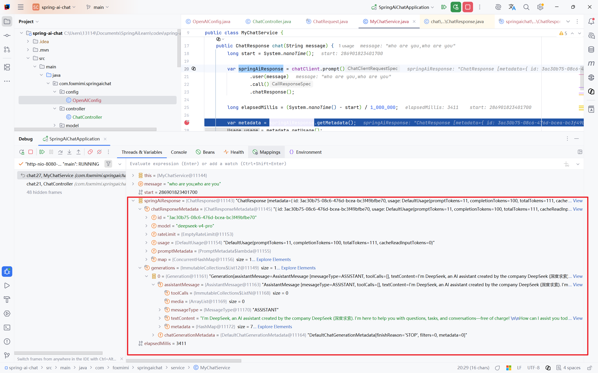
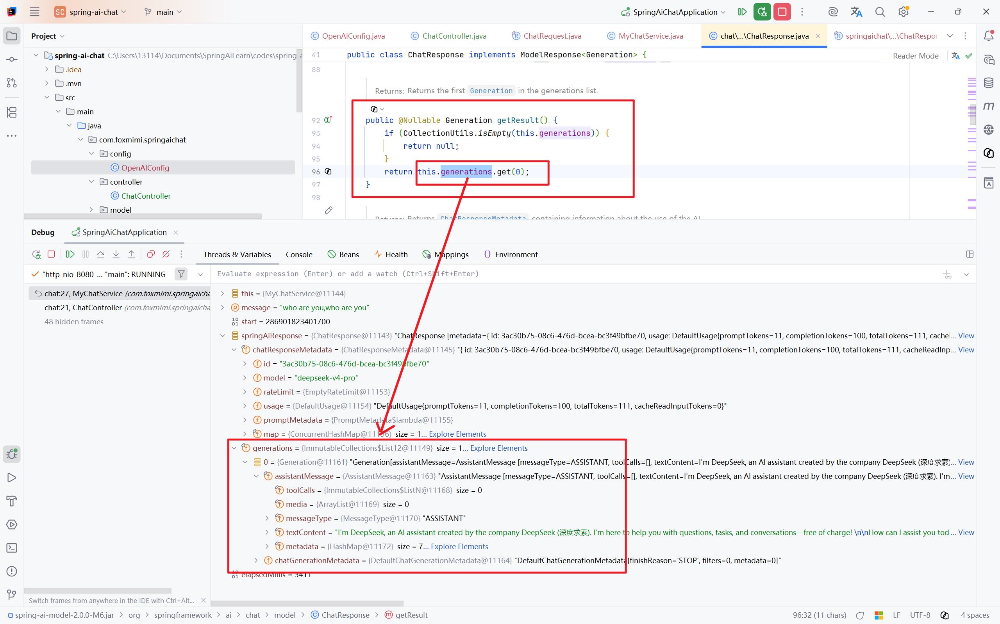

# 第 2 周学习笔记：Spring AI 与聊天服务

> **学习日期：** 2026-06-24～
>
> **学习阶段：** 第 2 周
>
> **文档定位：** 记录 Spring AI 的核心抽象、同步与流式聊天接口实现、测试过程，以及与第一周原生 Java HTTP 客户端的差异。
>
> **当前进度：** Day10 已完成，同步 `/api/chat` 端点及其 Mock/单元测试可用。

## 目录

- [1. Spring AI 同步调用](#1-spring-ai-同步调用)
- [2. ChatResponse 响应结构](#2-chatresponse-响应结构)
- [3. 获取模型答复内容](#3-获取模型答复内容)
- [4. 本次实现中的注意事项](#4-本次实现中的注意事项)
- [5. Day09：同步聊天端点实现](#5-day09同步聊天端点实现)
- [6. 异常处理设计](#6-异常处理设计)
- [7. Day09 验收结论](#7-day09-验收结论)
- [8. Day10：同步端点测试与异常映射验证](#8-day10同步端点测试与异常映射验证)

---

## 1. Spring AI 同步调用

当前使用 `ChatClient` 的链式 API 构造用户消息，并通过 `call().chatResponse()` 发起同步模型调用：

```java
var springAiResponse = chatClient.prompt()
        .user(message)
        .call()
        .chatResponse();
```

各步骤的职责如下：

1. `prompt()` 创建一次聊天请求的构造对象。
2. `user(message)` 添加用户消息。
3. `call()` 选择同步调用方式，并返回 `CallResponseSpec`。
4. `chatResponse()` 真正执行调用，返回 Spring AI 的 `ChatResponse`。

因此，不能把 `call()` 返回的 `CallResponseSpec` 当作已经取得的模型响应。真正的请求和结果读取发生在 `chatResponse()`、`content()` 等终结方法中。

## 2. `ChatResponse` 响应结构

调试结果表明，Spring AI 的 `ChatResponse` 主要由以下两部分组成：

```text
ChatResponse
├── metadata
│   ├── id
│   ├── model
│   ├── usage
│   │   ├── promptTokens
│   │   ├── completionTokens
│   │   └── totalTokens
│   └── 其他供应商或框架元数据
└── generations
    └── Generation
        ├── AssistantMessage
        │   ├── textContent
        │   ├── toolCalls
        │   ├── media
        │   └── metadata
        └── ChatGenerationMetadata
            └── finishReason
```



### 2.1 `ChatResponseMetadata`

`springAiResponse.getMetadata()` 返回 `ChatResponseMetadata`。当前 DeepSeek 兼容接口返回的主要字段包括：

- `id`：本次模型响应的标识；
- `model`：实际使用的模型名称；
- `usage`：Token 使用情况；
- `rateLimit`：限流信息；供应商没有返回时可能为空实现；
- 其他放入 metadata map 的扩展信息。

Token 用量可以通过以下方式获取：

```java
var metadata = springAiResponse.getMetadata();
Usage usage = metadata.getUsage();

long promptTokens = usage.getPromptTokens();
long completionTokens = usage.getCompletionTokens();
long totalTokens = usage.getTotalTokens();
```

其中：

- `promptTokens` 表示输入消息消耗的 Token；
- `completionTokens` 表示模型生成内容消耗的 Token；
- `totalTokens` 通常为输入与输出 Token 之和。

这些值来自上游模型服务返回的 usage 数据，并不是 Spring AI 在本地重新分词计算的结果。

### 2.2 `generations`

`generations` 是 `Generation` 列表。每个 `Generation` 表示一个候选生成结果，主要包含：

- `AssistantMessage`：模型生成的消息，包括文本、工具调用和媒体内容；
- `ChatGenerationMetadata`：该候选结果的结束原因等元数据，例如 `STOP`。

虽然当前请求通常只返回一个候选结果，但数据模型仍然使用列表，以兼容可能返回多个候选结果的模型或配置。

## 3. 获取模型答复内容

当前代码使用以下调用链取得模型回答：

```java
String content = springAiResponse.getResult()
        .getOutput()
        .getText();
```

这三个方法分别完成不同层次的解包：

```text
ChatResponse
  └── getResult()  -> Generation
        └── getOutput() -> AssistantMessage
              └── getText() -> String
```

### 3.1 `getResult()` 的含义

`ChatResponse#getResult()` 并不执行新的模型调用。它只是返回 `generations` 列表中的第一个元素：

```java
public @Nullable Generation getResult() {
    if (CollectionUtils.isEmpty(this.generations)) {
        return null;
    }
    return this.generations.get(0);
}
```



因此，可以近似理解为：

```java
springAiResponse.getResult()
```

等价于：

```java
springAiResponse.getResults().get(0)
```

但 `getResult()` 在列表为空时返回 `null`，而直接调用 `get(0)` 会抛出 `IndexOutOfBoundsException`。

### 3.2 `getOutput()` 的含义

`Generation#getOutput()` 返回的不是字符串，而是 `AssistantMessage`。该对象除回答文本外，还可能包含：

- 工具调用 `toolCalls`；
- 多模态内容 `media`；
- 消息级元数据 `metadata`；
- 消息角色 `ASSISTANT`。

因此，如果目标是取得纯文本回答，还需要继续调用 `getText()`：

```java
String content = springAiResponse.getResult()
        .getOutput()
        .getText();
```

## 4. 本次实现中的注意事项

### 4.1 一个响应规格对象不要执行两次

以下写法存在问题：

```java
var responseSpec = chatClient.prompt()
        .user(message)
        .call();

var response = responseSpec.chatResponse();
String content = responseSpec.content();
```

在当前使用的 Spring AI `2.0.0-M6` 中，`chatResponse()` 和 `content()` 都会触发响应执行。第一次调用会消费 advisor 调用链，第二次调用同一个 `responseSpec` 时可能出现：

```text
No CallAdvisors available to execute
```

正确方式是只执行一次 `chatResponse()`，然后从同一个响应对象读取 metadata 和回答内容：

```java
var response = chatClient.prompt()
        .user(message)
        .call()
        .chatResponse();

var metadata = response.getMetadata();
String content = response.getResult()
        .getOutput()
        .getText();
```

### 4.2 耗时必须覆盖终结调用

由于真正的同步请求发生在 `chatResponse()`，计时结束点必须放在该方法返回之后：

```java
long start = System.nanoTime();

var response = chatClient.prompt()
        .user(message)
        .call()
        .chatResponse();

long elapsedMillis = (System.nanoTime() - start) / 1_000_000;
```

如果在 `call()` 后、`chatResponse()` 前结束计时，得到的主要是本地对象构造耗时，而不是模型请求的端到端耗时。

### 4.3 返回值可能为空

`getResult()` 标注为 `@Nullable`，意味着框架允许 `generations` 为空。生产代码不能无条件假设以下对象一定存在：

- `ChatResponse`；
- `ChatResponseMetadata`；
- `Usage`；
- 第一个 `Generation`；
- `AssistantMessage` 的文本内容。

后续实现统一异常响应时，需要把空结果和上游异常转换为稳定的 HTTP 错误结构，避免直接暴露 `NullPointerException`。

## 5. Day09：同步聊天端点实现

> **计划日期：** 2026-06-26  
> **实际完成日期：** 2026-06-24  
> **目标：** 使用 Spring AI 实现同步 `POST /api/chat` 接口，并返回回答内容、模型名称、Token 用量和端到端耗时。

### 5.1 模块分层

本次实现将 HTTP 接入、模型调用和传输对象分开：

```text
HTTP Client
    │
    │ POST /api/chat
    ▼
ChatController
    │ 参数校验、去除首尾空白
    ▼
MyChatService
    │ 构造 Prompt、调用 ChatClient、解析响应
    ▼
ChatClient
    │
    ▼
OpenAiChatModel
    │ OpenAI 兼容协议
    ▼
DeepSeek API
```

各类职责如下：

| 类 | 职责 |
|---|---|
| `ChatController` | 定义 HTTP 路由、读取 JSON 请求体、校验用户输入 |
| `MyChatService` | 调用模型、统计耗时、提取回答和 Token 元数据 |
| `ChatRequest` | 定义客户端请求结构 |
| `ChatResponse` | 定义成功响应结构 |
| `ErrorResponse` | 定义失败响应结构 |
| `GlobalExceptionHandler` | 将 Java/Spring AI 异常映射为稳定的 HTTP 响应 |
| `OpenAIConfig` | 创建应用使用的 `ChatClient` Bean |

Controller 不直接依赖 `ChatClient`，因此 HTTP 协议处理与模型调用逻辑没有混在一起。后续增加流式接口时，可以继续复用模型配置，并在 Service 层增加独立的流式方法。

### 5.2 请求接口

接口定义为：

```http
POST /api/chat
Content-Type: application/json
```

请求体：

```json
{
  "message": "who are you"
}
```

对应 DTO：

```java
public record ChatRequest(String message) {
}
```

Controller 的实现如下：

```java
@PostMapping("/chat")
ChatResponse chat(@RequestBody ChatRequest request) {
    if (request == null || !StringUtils.hasText(request.message())) {
        throw new IllegalArgumentException("message 不能为空");
    }
    return chatService.chat(request.message().trim());
}
```

这里完成了两项边界处理：

1. 拒绝 `null`、空字符串和只包含空白字符的消息；
2. 调用 Service 前移除消息两端无意义的空白字符。

业务层不需要理解 HTTP 请求体，也不负责返回 HTTP 状态码。

### 5.3 同步模型调用

Service 使用 `ChatClient` 的阻塞式调用：

```java
long start = System.nanoTime();

var springAiResponse = chatClient.prompt()
        .user(message)
        .call()
        .chatResponse();

long elapsedMillis = (System.nanoTime() - start) / 1_000_000;
```

该接口会等待模型生成完成后一次性返回完整结果。它适合验证基本调用链和响应结构，但用户必须等待整个回答生成结束后才能看到内容。逐块返回属于后续流式端点的任务。

使用 `System.nanoTime()` 而不是 `System.currentTimeMillis()` 计算耗时，是因为前者适合测量单调递增的时间间隔，不受系统时间校准影响。

### 5.4 成功响应

自定义成功响应包含以下字段：

```java
public record ChatResponse(
        String model,
        String content,
        Integer promptTokens,
        Integer completionTokens,
        Integer totalTokens,
        Long elapsedMillis
) {
}
```

响应示例：

```json
{
  "model": "deepseek-v4-pro",
  "content": "I'm DeepSeek, an AI assistant...",
  "promptTokens": 11,
  "completionTokens": 100,
  "totalTokens": 111,
  "elapsedMillis": 3411
}
```

上述数值来自本次调试记录，只代表该次请求，不应当被当作固定性能数据。模型输出长度、网络状态、服务端负载和缓存命中情况都会影响 Token 数量与耗时。

### 5.5 空字段兼容

供应商兼容 OpenAI 协议，不代表每个响应字段都必然存在。当前 Service 对可空字段进行了降级处理：

| 字段 | 缺失时的处理 |
|---|---|
| 整个 `ChatResponse` | 抛出 `UpstreamResponseException` |
| 模型名称 | 返回 `"unknown"` |
| `Generation` 或回答文本 | 返回空字符串 |
| `Usage` | Token 数返回 `0` |

回答文本通过 `Optional` 安全提取：

```java
Optional.ofNullable(springAiResponse.getResult())
        .map(result -> result.getOutput())
        .map(output -> output.getText())
        .orElse("")
```

Token 数据则通过集中辅助方法读取，避免在构造响应时重复编写多层空值判断。

这种降级策略保证接口结构稳定，但也有代价：`0` 可能表示真实用量为零，也可能表示供应商没有返回 usage；空字符串也无法区分“模型生成了空内容”和“没有 Generation”。如果后续需要严格观测，应增加明确的可用性字段，而不是长期依赖默认值掩盖信息缺失。

## 6. 异常处理设计

### 6.1 统一错误结构

接口失败时返回统一的 `ErrorResponse`：

```java
public record ErrorResponse(
        String code,
        String message,
        long timestamp
) {
}
```

示例：

```json
{
  "code": "INVALID_REQUEST",
  "message": "message 不能为空",
  "timestamp": 1782291600000
}
```

统一结构使客户端不必解析 Spring Boot 默认错误页或 Java 异常文本，也避免将堆栈信息直接暴露给调用方。

### 6.2 异常映射

`GlobalExceptionHandler` 当前采用以下映射：

| 异常或场景 | HTTP 状态 | 错误码 | 对外信息 |
|---|---:|---|---|
| 消息为空 | `400` | `INVALID_REQUEST` | `message 不能为空` |
| JSON 无法解析 | `400` | `INVALID_REQUEST` | 请求体必须是合法的 JSON |
| 上游 Socket 超时 | `504` | `UPSTREAM_TIMEOUT` | 模型服务响应超时 |
| 其他瞬时 AI 异常 | `503` | `UPSTREAM_UNAVAILABLE` | 模型服务暂时不可用 |
| 非瞬时 AI 异常 | `502` | `UPSTREAM_ERROR` | 模型服务调用失败 |
| 上游返回空响应 | `502` | `UPSTREAM_ERROR` | 模型服务调用失败 |
| 未预期异常 | `500` | `INTERNAL_ERROR` | 服务器内部错误 |

其中，只有未预期异常记录完整错误堆栈；可预期的参数错误不需要作为服务器故障记录。

### 6.3 当前映射的边界

Spring AI 的 `TransientAiException` 和 `NonTransientAiException` 是框架层分类，并不等价于第一周自定义的 `LlmErrorType`。当前实现做的是面向 HTTP 客户端的粗粒度映射：

- 临时故障通常映射为 `503`；
- 明确的 Socket 超时映射为 `504`；
- 其他上游不可恢复异常统一映射为 `502`。

这种设计避免把供应商异常细节泄漏给客户端，但也损失了认证失败、模型不存在、配额耗尽等具体类别。Day10 已验证当前 HTTP 边界映射稳定；是否进一步细分错误码，仍需基于真实供应商错误与 Spring AI 异常类型的对应关系决定。

## 7. Day09 验收结论

### 7.1 完成项

- [x] 使用 Spring AI `ChatClient` 完成同步模型调用
- [x] `POST /api/chat` 可接收 JSON 消息并返回模型回答
- [x] 响应包含模型名称、回答内容、输入/输出/总 Token 和耗时
- [x] `ChatController` 只处理 HTTP 路由、请求读取和边界校验
- [x] `MyChatService` 封装模型调用和响应转换
- [x] 提供 `ChatRequest`、`ChatResponse` 和 `ErrorResponse`
- [x] 空消息、非法 JSON、上游异常和未知异常均有结构化错误响应
- [x] 已完成一次真实 DeepSeek API 端到端调用

### 7.2 本日关键结论

1. `ChatClient` 简化了 Prompt 构造、模型调用和响应对象转换，但没有消除对响应结构和可空字段的理解要求。
2. `call()` 只选择同步调用路径，`chatResponse()` 或 `content()` 才会执行并读取结果。
3. 同一个 `CallResponseSpec` 不应重复调用多个终结方法，否则当前 Spring AI 版本可能因 advisor 链已被消费而失败。
4. Spring AI 返回的是框架统一模型：全局元数据位于 `ChatResponseMetadata`，候选回答位于 `generations`。
5. 框架异常分类比第一周的 `LlmErrorType` 粗，需要通过受控测试验证 HTTP 边界映射是否稳定。
6. 同步接口适合建立正确性基线；交互体验仍受完整生成耗时限制，后续需要流式端点改善首字节等待时间。

### 7.3 遗留问题

- 空回答和缺失 usage 目前使用默认值降级，无法表达数据“缺失”与真实零值的区别；
- 已验证框架级异常到 HTTP 响应的映射，但尚未验证所有供应商原始错误与 Spring AI 异常类型之间的对应关系；
- 日志包名 `com.foxmimi.springaidemo` 与当前模块包名不一致，需要后续调整；
- `deepseek-v4-pro` 是否为供应商实际公开模型标识，应以接口返回和供应商文档为准，不能仅根据本地配置推断。

以上遗留项不影响 Day09 同步端点功能验收。

## 8. Day10：同步端点测试与异常映射验证

### 8.1 今日目标

为同步 `/api/chat` 端点补充可重复执行的 Mock/单元测试，隔离需要真实 API Key 和网络的测试，并验证统一异常处理器的主要 HTTP 映射。

### 8.2 测试分层

本日测试按边界分为三层：

| 层级 | 测试对象 | 外部依赖 | 主要验证内容 |
|---|---|---|---|
| Controller 单元测试 | `ChatController`、`GlobalExceptionHandler` | 无 | 请求校验、成功响应和异常到 HTTP 状态的映射 |
| Service 单元测试 | `MyChatService` | 无 | Spring AI 响应解析、默认值降级和空响应处理 |
| 集成测试 | Spring 容器、HTTP 端点、真实模型服务 | API Key、网络 | 真实同步调用和端到端响应结构 |

Controller 测试通过 Mockito 模拟 `MyChatService`，Service 测试通过 Mockito 模拟 `ChatClient`。因此默认测试不需要真实 API Key，也不会产生模型调用费用。

需要真实环境的 `OpenAIChatTest`、`SpringAiChatApplicationTests` 和 `ChatIntegrationTest` 使用 `@Tag("integration")` 标记；Maven Surefire 默认排除该标签，使日常测试只运行确定性较高的本地测试。

### 8.3 新增与补充的测试场景

Controller 层当前覆盖：

- 合法请求返回完整的 `ChatResponse`；
- 空白消息、非法 JSON 和空请求体返回 `400 INVALID_REQUEST`；
- 普通 `TransientAiException` 返回 `503 UPSTREAM_UNAVAILABLE`；
- 根因包含 `SocketTimeoutException` 的瞬时异常返回 `504 UPSTREAM_TIMEOUT`；
- `NonTransientAiException` 返回 `502 UPSTREAM_ERROR`；
- `UpstreamResponseException` 返回 `502 UPSTREAM_ERROR`；
- 未预期的运行时异常返回 `500 INTERNAL_ERROR`。

Service 层当前覆盖：

- 正常响应中的模型名称、回答内容和 Token 用量能够正确转换；
- Generation 或 Metadata 缺失时使用稳定默认值；
- Spring AI 返回 `null` 响应时抛出 `UpstreamResponseException`，避免继续解引用造成无语义的空指针异常。

### 8.4 自动化测试结果

执行命令：

```powershell
mvn clean test
```

执行结果：

```text
Tests run: 12, Failures: 0, Errors: 0, Skipped: 0
BUILD SUCCESS
```

其中：

- `ChatControllerTest`：9 个测试；
- `MyChatServiceTest`：3 个测试；
- 默认测试未执行带有 `integration` 标签的真实 API 测试。

### 8.5 异常映射验证结论

| 测试输入 | Spring/业务异常 | HTTP 状态 | 错误码 | 结论 |
|---|---|---:|---|---|
| 空白、非法或缺失请求体 | MVC 参数解析或校验异常 | `400` | `INVALID_REQUEST` | 客户端输入错误不会进入模型调用 |
| 临时上游故障 | `TransientAiException` | `503` | `UPSTREAM_UNAVAILABLE` | 提示调用方稍后重试 |
| Socket 读取超时 | `TransientAiException` 包含 `SocketTimeoutException` | `504` | `UPSTREAM_TIMEOUT` | 超时与普通临时故障可以区分 |
| 不可恢复的 AI 调用错误 | `NonTransientAiException` | `502` | `UPSTREAM_ERROR` | 对外隐藏供应商内部错误细节 |
| 上游返回空响应 | `UpstreamResponseException` | `502` | `UPSTREAM_ERROR` | 将非法上游响应转为稳定网关错误 |
| 未分类程序异常 | `RuntimeException` | `500` | `INTERNAL_ERROR` | 避免向客户端暴露堆栈和内部实现 |

这些测试证明的是本项目异常处理器的边界行为，而不是供应商错误分类本身。认证失败、模型不存在和配额耗尽等供应商场景在 Spring AI 中最终落入何种异常类型，仍取决于框架版本及上游响应，不能仅根据手工构造的 `NonTransientAiException` 推断。

### 8.6 Day10 验收结论

- [x] 默认 Maven 测试只运行本地 Mock/单元测试
- [x] 默认测试不依赖真实 API Key 和网络
- [x] Controller 测试覆盖正常请求、输入错误、超时、瞬时异常、非瞬时异常和未知异常
- [x] Service 测试覆盖正常响应、缺失字段降级和空响应
- [x] 12 个自动化测试全部通过
- [x] 形成 Spring AI 异常到 HTTP 状态及业务错误码的对照表

### 8.7 本日关键结论

1. 测试的核心不是数量，而是切断不稳定的外部依赖，使默认测试能够低成本重复执行。
2. `TransientAiException` 只能说明框架认为错误可能恢复，不能直接推出限流、网络抖动或服务过载中的具体一种原因。
3. 超时需要沿异常因果链检查 `SocketTimeoutException`，只检查最外层异常类型会把 `504` 错误地归并到普通 `503`。
4. 空响应不是正常的“空回答”。前者属于上游协议或框架边界异常，应返回 `502`；后者可以按业务约定降级为空字符串。
5. HTTP 错误码应面向接口调用方保持稳定，不应直接复制供应商错误文本或暴露 Java 异常堆栈。
